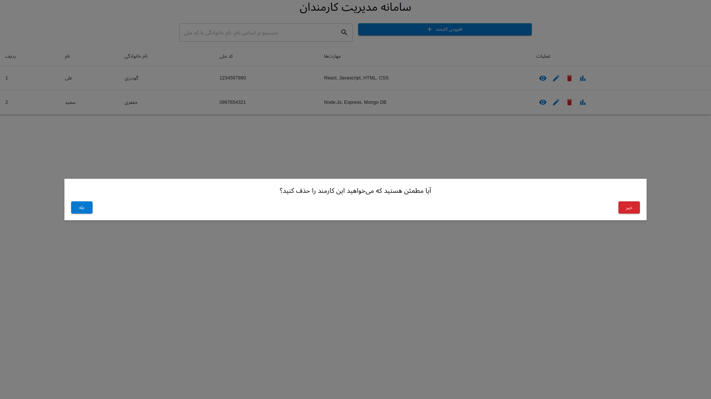
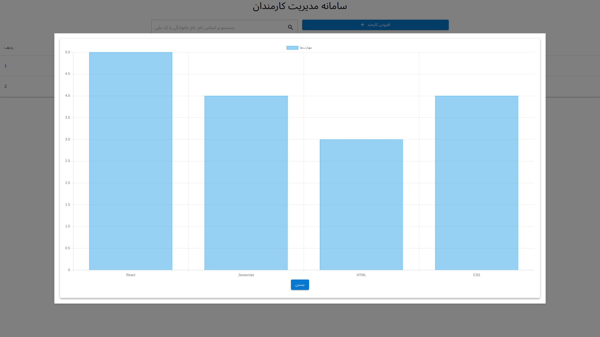

# Employee Management System

This is a simple Employee Management System built using React and Material-UI.

## Features

- Add, edit, and delete employee details.
- View a list of employees.
- View detailed employee information including their skills and a chart representing their skill levels.

## Installation

1. Clone the repository:

git clone https://github.com/your-username/employee-management-system.git

2. Navigate to the project directory:

cd employee-management-system

3. Install dependencies:

npm install

4. Start the application:

npm start

## Screenshots

## Technologies Used

- React
- Material-UI
- Chart.js

## License

This project is licensed under the MIT License - see the [LICENSE](LICENSE) file for details.
